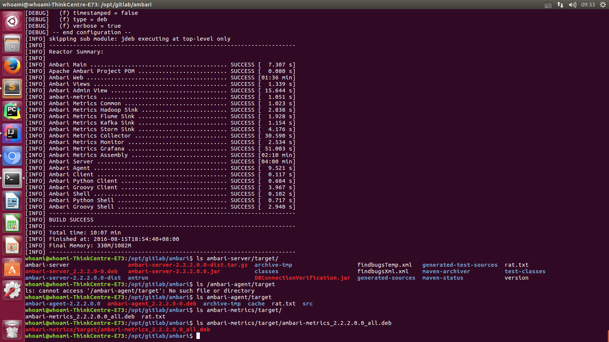

# ubuntu for sublime-test-3 install
```
	sudo add-apt-repository ppa:webupd8team/sublime-text-3

	sudo apt-get update 


	sudo apt-get install sublime-text-installer
```

# ubuntu for pycharm
	- https://www.jetbrains.com/pycharm/
	- Download Professional | Full-featured IDE for Python & Web development

# ubuntu for intelliJIDEA
	- https://www.jetbrains.com/idea/
	- Download Ultimate | For web and enterprise development 

# ubuntu for chromium web Browser
  keyboard `win` Key >> ubuntu software >> Enter >> search chromium web Browser >> selecting && install 

# ubuntu for env

```
whoami@whoami-ThinkCentre-E73:/opt/gitlab/books$ cat ~/.bashrc |tail -8
export JAVA_HOME=/opt/cloud/jdk
export IDEA_HOME=/opt/cloud/idea
export PY_HOME=/opt/cloud/pycharm

export PATH=.:$IDEA_HOME/bin:$PY_HOME/bin:$JAVA_HOME/bin:$PATH

export CLASSPATH=.:$JAVA_HOME/lib/dt.jar:$JAVA_HOME/lib/tools.jar

```

# ubuntu for dev


# ubuntu for git
```
sudo apt-get install git 	# install git

cd /opt/gitlab

git clone git@github.com:apache/ambari.git 	# git project

git branch -a    # all branch info list

git checkout -t origin/branch-2.2.2	# switch branch


whoami@whoami-ThinkCentre-E73:/opt/gitlab/ambari$ git branch
* branch-2.2.2
  trunk	  # default selecting

```

# ubuntu 16.4 for ambari
	https://cwiki.apache.org/confluence/display/AMBARI/Ambari+Development

- python 2.7

```
sudo sh setuptools-0.6c11-py2.7.egg
sudo apt-get install python-dev
```

- install dependency node && npm
```
https://nodejs.org/dist/v0.10.44/	# version v0.10.44, 0.12.x won't work. 

whoami@whoami-ThinkCentre-E73:/opt/cloud/node/bin$ cat ~/.bashrc |grep NODE
export NODE_HOME=/opt/cloud/node
export PATH=.:$NODE_HOME/bin:$MVN_HOME/bin:$IDEA_HOME/bin:$PY_HOME/bin:$JAVA_HOME/bin:$PATH
```

# build ambari 
	- https://cwiki.apache.org/confluence/display/AMBARI/Coding+Guidelines+for+Ambari
	- by https://github.com/apache/ambari/releases/tag/release-2.2.2
	
```
	$ npm install -g brunch@1.7.20

	$ cd ambari/ambari-web
	$ rm -rf node_modules public
	$ npm install
	$ ulimit -n 10000
	$ brunch build

	$ brunch watch --server (or use the shorthand: brunch w -s)
```

* For example
```
	whoami@whoami-ThinkCentre-E73:/opt/gitlab/ambari/ambari-web$ brunch w -s
	15 Aug 11:17:58 - info: application started on http://localhost:3333/

	whoami@whoami-ThinkCentre-E73:/opt/gitlab/ambari$ mvn clean package -DskipTests -Drat.ignoreErrors=true # mvn package
```

* build deploy package

```
$ mvn versions:set -DnewVersion=2.2.2.0.0
$ pushd ambari-metrics
$ mvn versions:set -DnewVersion=2.2.2.0.0
$ popd

$ export MAVEN_OPTS="-Xmx2g -XX:MaxPermSize=512M -XX:ReservedCodeCacheSize=512m"

$ mvn -B clean install package jdeb:jdeb -DnewVersion=2.2.2.0.0 -DskipTests -Dpython.ver="python >= 2.6" -Drat.numUnapprovedLicenses=100 -X -Preplaceurl	#for ubuntu


$ mvn -B install package rpm:rpm -DnewVersion=2.2.1 -DskipTests -Dpython.ver="python >= 2.6" -Preplaceurl #For redhat/centos

```

* build ubuntu 16.4 deb package


* FAQ 

```
[ERROR] Failed to execute goal com.github.eirslett:frontend-maven-plugin:0.0.16:npm (npm install) on project ambari-admin: Failed to run task: 'npm install --unsafe-perm --color=false' failed. (error code 1) -> [Help 1]

ambari-admin project change pom.xml , comment centent 
   <!--<plugin>
        <groupId>com.github.eirslett</groupId>
        <artifactId>frontend-maven-plugin</artifactId>
        <version>0.0.16</version>
        <configuration>
          <nodeVersion>v0.10.44</nodeVersion>
          <npmVersion>2.15.0</npmVersion>
          <workingDirectory>src/main/resources/ui/admin-web/</workingDirectory>
        </configuration>
        <executions>
          <execution>
            <id>install node and npm</id>
            <phase>generate-sources</phase>
            <goals>
              <goal>install-node-and-npm</goal>
            </goals>
          </execution>
          <execution>
            <id>npm install</id>
            <phase>generate-sources</phase>
            <goals>
              <goal>npm</goal>
            </goals>
            <configuration>
              <arguments>install &#45;&#45;unsafe-perm</arguments>
            </configuration>
          </execution>
        </executions>
      </plugin>-->

[ERROR] Failed to execute goal org.vafer:jdeb:1.0.1:jdeb (default-cli) on project ambari-metrics-hadoop-sink: Failed to create debian package /opt/gitlab/ambari-release-2.2.2/ambari-metrics/ambari-metrics-hadoop-sink/target/ambari-metrics-hadoop-sink_2.2.2.0.0_all.deb: "/opt/gitlab/ambari-release-2.2.2/ambari-metrics/ambari-metrics-hadoop-sink/src/main/package/deb/control" is not a valid 'control' directory) -> [Help 1]
org.apache.maven.lifecycle.LifecycleExecutionException: Failed to execute goal org.vafer:jdeb:1.0.1:jdeb (default-cli) on project ambari-metrics-hadoop-sink: Failed to create debian package /opt/gitlab/ambari-release-2.2.2/ambari-metrics/ambari-metrics-hadoop-sink/target/ambari-metrics-hadoop-sink_2.2.2.0.0_all.deb

ambari-metrics fails to package from .deb on ubuntu 16.04 LTS BUG:
	- https://issues.apache.org/jira/browse/AMBARI-12977
```


# ubuntu for docker
```
 sudo apt-get install docker.io
 
 /etc/init.d/docker start

sudo systemctl stop docker.service
sudo systemctl start docker.service

sudo systemctl status docker.service

sudo docker images

```

# docker registry For Portus install
 http://www.dockerinfo.net/879.html 
```
$ git clone git@github.com:SUSE/Portus.git

$ sudo apt install python-pip

$ sudo apt install docker-compose

$ sudo pip install --upgrade pip

root@whoami-ThinkCentre-E73:~# docker-compose version
docker-compose version 1.8.0, build 94f7016
docker-py version: 1.9.0
CPython version: 2.7.12
OpenSSL version: OpenSSL 1.0.2g-fips  1 Mar 2016

whoami@whoami-ThinkCentre-E73:~$ docker-compose version
docker-compose version 1.8.0, build 94f7016
docker-py version: 1.9.0
CPython version: 2.7.12
OpenSSL version: OpenSSL 1.0.2g-fips  1 Mar 2016

+ install registory auto
whoami@whoami-ThinkCentre-E73:/opt/gitlab/Portus$ ./compose-setup.sh -e onlyeric.reg

###########
# WARNING #
###########

This deployment method is intended for testing/development purposes.
To deploy Portus on production please take a look at: http://port.us.org/documentation.html

You have to use docker-compose 1.6 or later.

$ sudo pip install --upgrade docker-compose

....
....

Portus: configuring database... [SUCCESS]

###################
#     SUCCESS     #
###################

Make sure port 3000 and 5000 are open on host onlyeric.reg

Open http://onlyeric.reg:3000 with your browser and perform the following steps:

  1. Create an admin account
  2. You will be redirected to a page where you have to register the registry. In this form:
    - Choose a custom name for the registry.
    - Enter onlyeric.reg:5000 as the hostname.
    - Do *not* check the "Use SSL" checkbox, since this setup is not using SSL.

Perform the following actions on the docker hosts that need to interact with your registry:

  - Ensure the docker daemon is started with the '--insecure-registry onlyeric.reg:5000'
  - Perform the docker login.

To authenticate against your registry using the docker cli do:

  $ docker login -u <portus username> -p <password> -e <email> onlyeric.reg:5000

To push an image to the private registry:

  $ docker pull busybox
  $ docker tag busybox onlyeric.reg:5000/<username>busybox
  $ docker push onlyeric.reg:5000/<username>busybox

WebUI: http://portus.onlyeric.com:3000/users/sign_up # create admin account...,start Portus registry trip.
registryAddr: onlyeric.reg:5000


* login webui,config base info success...

root@whoami-ThinkCentre-E73:/opt/gitlab/Portus# docker login -u admin -p admin123 onlyeric.reg:5000
Error response from daemon: Get https://onlyeric.reg:5000/v1/users/: http: server gave HTTP response to HTTPS client

	+ change DOCKER_OPTS add content

	root@whoami-ThinkCentre-E73:/opt/gitlab/Portus# cat /etc/default/docker |grep 5000
	DOCKER_OPTS="--dns 8.8.8.8 --dns 8.8.4.4 --insecure-registry onlyeric.reg:5000"


# docker login -u admin -p admin123 onlyeric.reg:5000
Login Succeeded


# docker pull busybox
# docker tag busybox onlyeric.reg:5000/admin/busybox:latest
# docker push onlyeric.reg:5000/admin/busybox:latest
```

# SkynetEye

* agent && server by env

```
$ pip install msgpack-rpc-python


```


# Ambari HDPDocuments
  - http://docs.hortonworks.com/HDPDocuments/Ambari/Ambari-2.2.2.0/index.html
  - http://docs.hortonworks.com/HDPDocuments/Ambari-2.2.2.0/bk_Installing_HDP_AMB/content/_hdp_stack_repositories.html


spark-submit   --class streaming.core.StreamingApp \
--master yarn-cluster \
--name sql-interactive \
/tmp/streamingpro-0.3.4-SNAPSHOT-online-1.6.1.jar    \
-streaming.name sql-interactive    \
-streaming.platform spark   \
-streaming.rest true   \
-streaming.driver.port 9004   \
-streaming.spark.service true	\
-streaming.zk.servers bigdata-hdp-server-3:2181,bigdata-hdp-server-1:2181,bigdata-hdp-server-2:2181 \
-streaming.zk.conf_root_dir  /streamingpro/sparkstreaming 

+ '/zeppelin-' + zeppelin + '*.pid'

pid_file=glob.glob('/var/run/zeppelin-notebook' + '/zeppelin-'+ 'zeppelin'+ '*.pid')[0]
